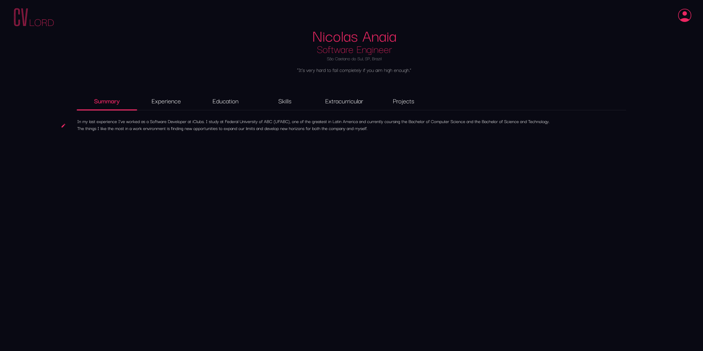

> CVLord é um projeto baseado em [next.js](https://nextjs.org/) and [Node.js] (https://nodejs.org/en). O intuito da CVLord é fazer com que todos profissionais tenham um site para que seu
CV seja armazenado, com APIs abertas para que sites de terceiros possam pegar informações
no momento de cadastro do profissional em suas próprias plataformas.

